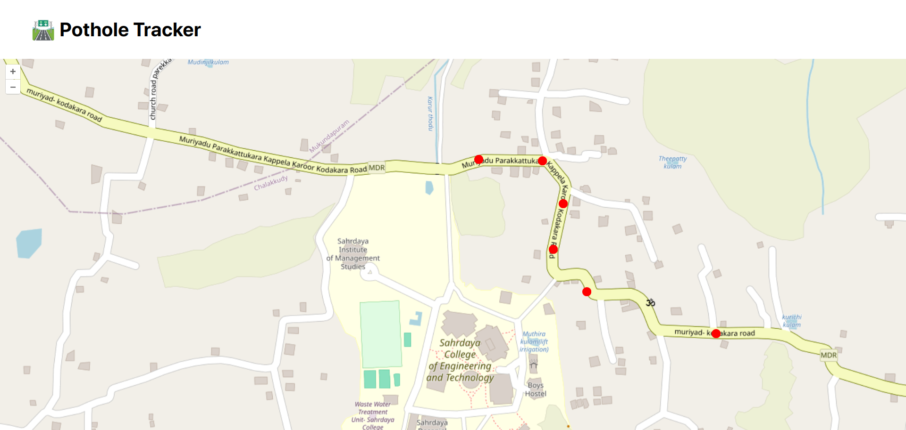

## Pothole Detection and Mapping using YOLOv4 🛣️

**Github repo of S6 Miniproject**

> Special Thanks to [LearnOpenCV Tutorial](https://learnopencv.com/pothole-detection-using-yolov4-and-darknet/)

This directory should contain following:

```
pothole
├── darknet
├── dataset <= Dataset
├── pothole-map <= Contains Map application for mapping potholes
├── pothole_road.mp4 <= Test video for testing pothole detection
└── readme.md <= This file

```

due to size constraints, dataset is omitted from this repo. You can download dataset from [here](https://learnopencv.s3.us-west-2.amazonaws.com/pothole-dataset.zip)

## For tutorial on pothole detection (basic object detection using YOLOv4), you can follow [Learn OpenCV Tutorial](https://learnopencv.com/pothole-detection-using-yolov4-and-darknet/)

> This directory contains trained weights so you won't need to train it again


## ./Pothole-map



Its a vite application which shows which roads have potholes. Presently all potholes in map is mapped using pre-defined values of latitude and longitude, but it can be simply modified to a detection -> db -> map model

Current version is also hosted [here](https://pothole-tracker-website.vercel.app/)
